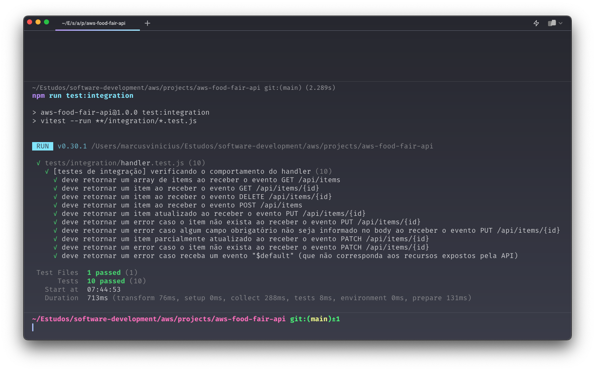
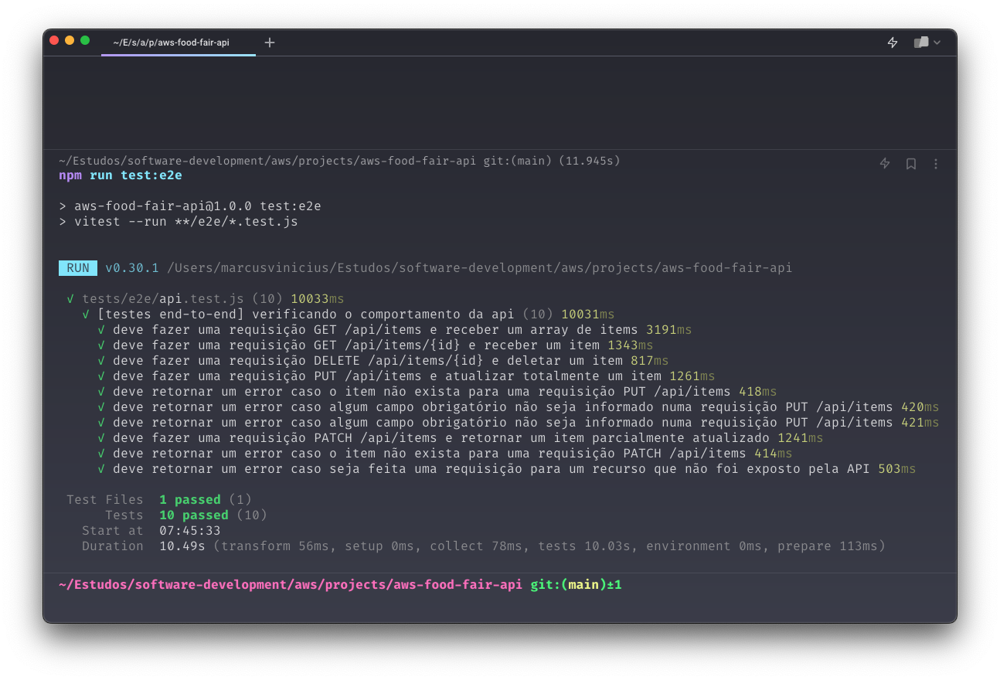

<h1 id="header" align="center">AWS Food Fair API</h1>

Este é um projeto simples. Uma API para CRUD de itens de uma Feira (ou Mercado) de Alimentos, utilizando recursos da AWS com testes automatizados de integração e end-to-end

## O que foi exercitado?

* [x] Clean Code
* [x] Testes de Integração e End-To-End
* [x] REST API
* [x] AWS Lambda
* [x] AWS DynamoDB
* [x] AWS API Gateway

Todos os serviços da AWS foram criados e integrados manualmente através do console da AWS. A função Lambda, pode ser editada, testada e atualizada (através da CLI), na máquina local (veja [Implantação](#implantação)).

## Passo a passo

O passo a passo está disponível [neste artigo](https://medium.com/@marcusviniciusfa/aws-food-fair-api-3244aa843d70). Através dele, você aprenderá a reproduzir a criação e integração da infraestrutura deste projeto, diretamente no console da AWS.

## Testes

### Pendências

* `git clone https://github.com/marcusviniciusfa/aws-food-fair-api.git && cd aws-food-fair-api` baixe o repositório do projeto e entre no diretório raiz.
* `npm install` instale as dependências do projeto.
* `echo API_GATEWAY_BASE_URL=url >> .env` crie um arquivo `.env` (responsável por armazenar as variáveis de ambiente) na raiz do projeto, e adicione a variável API_GATEWAY_BASE_URL contendo o valor da URL de invocação do API Gateway. O arquivo pode ser criado manualmente.

### Algumas considerações

Os testes automatizados levaram em consideração a estrutura [Given, When, Then](https://martinfowler.com/bliki/GivenWhenThen.html) e os seguintes princípios do [Test FIRST](https://engsoftmoderna.info/cap8.html#princ%C3%ADpios-first):

  * Independent (I) - Cada caso de teste deve ser independente, ou seja, não influenciar e não ser influenciado por outros casos de teste.

  * Repeatable (R) - Deve ser possível executar um mesmo caso de teste _n_ vezes sem que hajam surpresas, o resultado esperado deve ser sempre o mesmo.

  * Self-validating (S) - Os testes devem ser capazes de validar a si mesmos, verificando os resultados e fazendo com que o caso de teste passe ou falhe, sem a necessidade de interpretação ou alguma intervenção manual.

### Testando o handler

A função [handler](./index.mjs) é o código que deve ser implantado
no serviço Lambda da AWS. Os testes de integração verificam o funcionamento das funcionalidades integradas e podem fazer uso do banco de dados ou não. No nosso caso, o banco de dados DynamoDB foi substituído por _stubs_ (veja mais sobre ["dublês de teste"](https://martinfowler.com/bliki/TestDouble.html)) para simular e retornar um valor programado conforme o esperado para cada cenário de teste.

Você pode executar os testes de integração através do script:

~~~sh
npm run test:integration
~~~

Ao executar os casos de teste de integração você deverá ter uma saída semelhante a imagem a baixo.

  

### Testando a API

Os testes end-to-end verificam o funcionamento das funcionalidades de "ponta-a-ponta". No projeto em questão, eles fazem solicitações HTTP para o API Gateway, que recebe e distribui as solicitações como eventos para a função Lambda. Neste caso, diferente dos [testes de integração](#testando-o-handler), o banco de dados DynamoDB foi estimulado e os resultados são reais.

Você pode executar os testes end-to-end através script a seguir:

~~~sh
# esses casos de teste são uma ótima documentação para a API
npm run test:e2e
~~~

Ao executar os casos de testes end-to-end você deverá ter uma saída semelhante a imagem a baixo.

  

## Implantação

Para utilizar os scripts abaixo e fazer a implantação/atualização da função Lambda é necessário ter a CLI da AWS. Caso ainda não tenha faça a instalação através do site https://aws.amazon.com/pt/cli. Verifique a instalação com o comando `aws --version`. Com a CLI instalada, configure sua conta com o comando `aws configure`.

~~~sh
# cria um arquivo function.zip contendo o função handler que será implantada
npm run build

# faz a implantação da função handler na AWS
npm run deploy

# verifica os testes de integração e faz a implantação "segura" da função handler na AWS
npm run deploy:security
~~~

## Considerações finais

Preciso deixar claro que é um boa prática na construção de funções Lambda, que elas sejam curtas (com pouco código) e dedicadas a uma única operação. Assim elas podem ser mais rápidas, mais legíveis e mais manuteníveis. No nosso caso, cada endpoint deveria então estar associado a apenas uma função Lambda. Porém, nossa função handler recebe todos os tipos de solicitação HTTP, e direciona os eventos para o código que deve tratá-lo, tudo isso dentro de uma mesma função. Resolvi fazer dessa maneira por ser um projeto inicial e de estudos. Entretanto, a forma como o código está estruturado, permite que ele seja facilmente quebrado em partes menores e movido para outras funções Lambda, seguindo o princípio [Single Responsibility](https://github.com/marcusviniciusfa/clean-code-javascript#princ%C3%ADpio-da-responsabilidade-%C3%BAnica-srp) do SOLID. Pretendo criar uma segunda branch com esta alteração, e assim, demonstrar como deve ser uma função Lambda em um ambiente real. Por ora, você pode trabalhar nisso se quiser, e caso o faça, eu gostaria muito de saber da sua contribuição. Vale lembrar que como estamos fazendo uso do API Gateway, uma mudança desse tipo (divisão da função Lambda em várias funções) deve ser transparente para os clientes da API, que não devem fazer adaptações em suas solicitações HTTP a fim de continuar utilizando a API de forma correta.

## Documentação da API

### Rotas e respostas as solicitações

Uma pequena documentação das rotas disponíveis e exemplos de respontas, com status code e corpo da solicitação.

#### `GET /api/items`

Retorna todos os itens da base de dados

  * `200 OK`

    ~~~json
    [
      {
        "price": 9.99,
        "id": "6cc2ddf7-1d1b-4cef-9d60-644d5c47498b",
        "name": "item-1"
      },
      {
        "price": 3.99,
        "id": "94649e4b-5851-4488-a660-f39b75923598",
        "name": "item-2"
      }
    ]
    ~~~

#### `GET /api/items/{id}`

Retorna um item da base de dados, selecionado pelo seu identificador

  * `200 OK`

    ~~~json
    {
      "price": 9.99,
      "id": "6cc2ddf7-1d1b-4cef-9d60-644d5c47498b",
      "name": "item-1"
    }
    ~~~

  * `404 Not Found`

    ~~~json
    {
      "error": "item not found"
    }
    ~~~

#### `DELETE /api/items/{id}`

Deleta um item na base de dados, selecionado pelo seu identificador

  * `204 No Content`

    ~~~json
    {}
    ~~~

#### `POST /api/items`

Insere um item na base de dados

  * body

    ~~~json
    {
      "price": 9.99,
      "name": "item-1"
    }
    ~~~

    * `201 Created`

      ~~~json
      {
        "price": 9.99,
        "id": "6cc2ddf7-1d1b-4cef-9d60-644d5c47498b",
        "name": "item-1"
      }
      ~~~

  * body

    ~~~json
    {
      "id": "6cc2ddf7-1d1b-4cef-9d60-644d5c47498b",
      "name": "item-1"
    }
    ~~~

    * `400 Bad Request`

      ~~~json
      {
        "error": "#price field is required"
      }
      ~~~

#### `PUT /api/items/{id}`

Atualiza, de forma integral, um item na base de dados, selecionado pelo seu identificador

  * body

    ~~~json
    {
      "price": 9.99,
      "name": "item-1"
    }
    ~~~

    * `200 OK`

      ~~~json
      {
        "price": 9.99,
        "id": "6cc2ddf7-1d1b-4cef-9d60-644d5c47498b",
        "name": "item-1"
      }
      ~~~

    * `404 Not Found`

      ~~~json
      {
        "error": "item not found"
      }
      ~~~

  * body

    ~~~json
    {
      "price": 9.99,
    }
    ~~~

    * `400 Bad Request`

      ~~~json
      {
        "error": "#name field is required"
      }
      ~~~

#### `PATCH /api/items/{id}`

Atualiza, de forma parcial, um item na base de dados, selecionado pelo seu identificador

  * body

    ~~~json
    {
      "price": 9.99,
    }
    ~~~

    * `200 - OK`

      ~~~json
      {
        "name": "item-1"
      }
      ~~~

    * `404 - Not Found`

      ~~~json
      {
        "error": "item not found"
      }
      ~~~

[⬆️ topo](#header)
